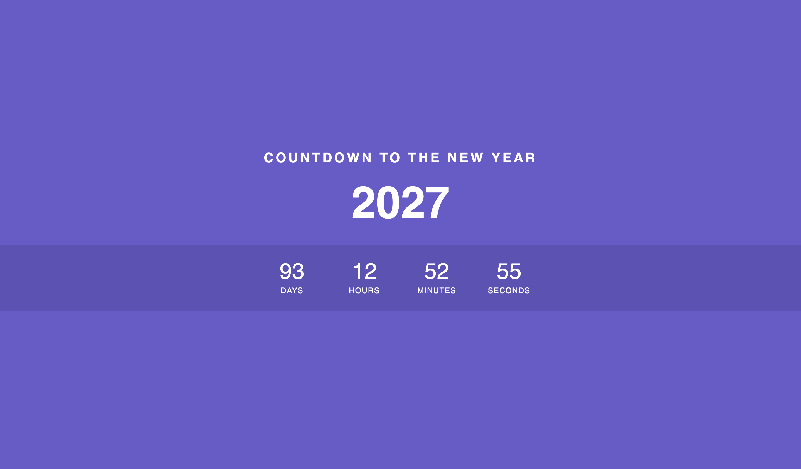

<h1> New Years Countdown Clock </h1>

<p> A New Years countdown clock built using HTML, CSS, and JavaScript. This project demonstrates fundamental concepts of JavaScript such as dynamic functionality and real-time updates in web design. </p>

<!---->



<h2> Features </h2>

<ul>
    <li> Event Handling </li>
    <li> Time Calculations </li>
    <li> Responsive Design </li>
</ul>

<h2> Technologies Used </h2>

<ul>
    <li> HTML </li>
    <li> CSS </li>
    <li> JavaScript</li>
</ul>

<h2> Project Structure </h2>

```
└── 📁new-year-countdown
    └── 📁images
        ├── new-year-countdown.jpg
    ├── styles.css
    ├── index.js
    ├── .gitignore
    ├── LICENSE
    ├── index.html
    └── README.md
```


<h2> Getting Started </h2>

<ol>
    <li> Download or clone this repository. </li>
    <li> Open the project folder. </li>
    <li> Double-click index.html, or open it in your preferred web browser. </li>
</ol>

<p> No additonal software or installation is needed </p>

<h2> Future Improvements </h2>

<ul>
    <li> Improve responsive design to support UX </li>
    <li> Include theme-related animations to make project more visually appealing </li>
</ul>

<h2> Author </h2>

<p> Created by Anaia Johnson </p>